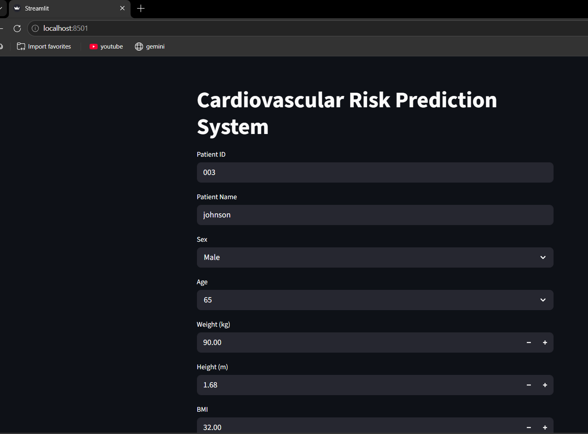
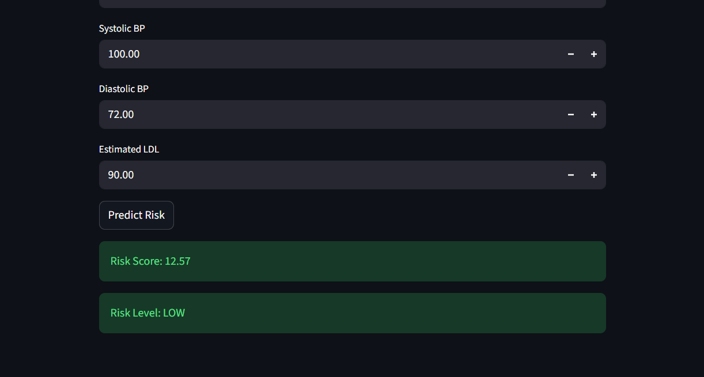
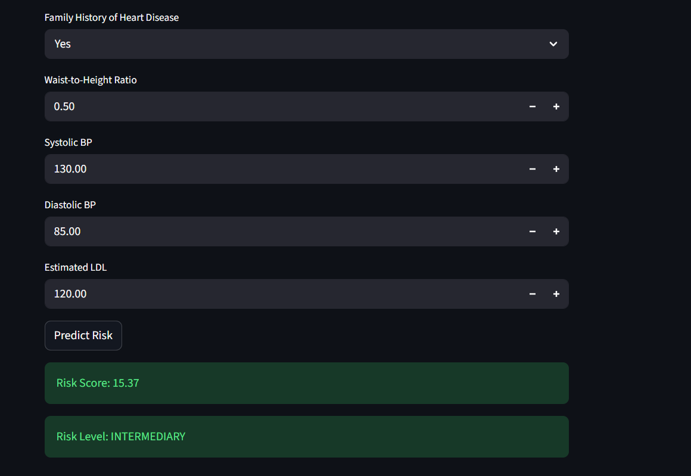
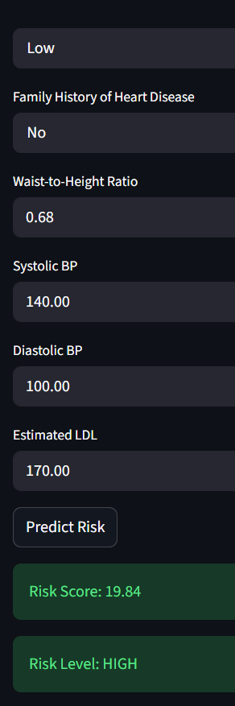
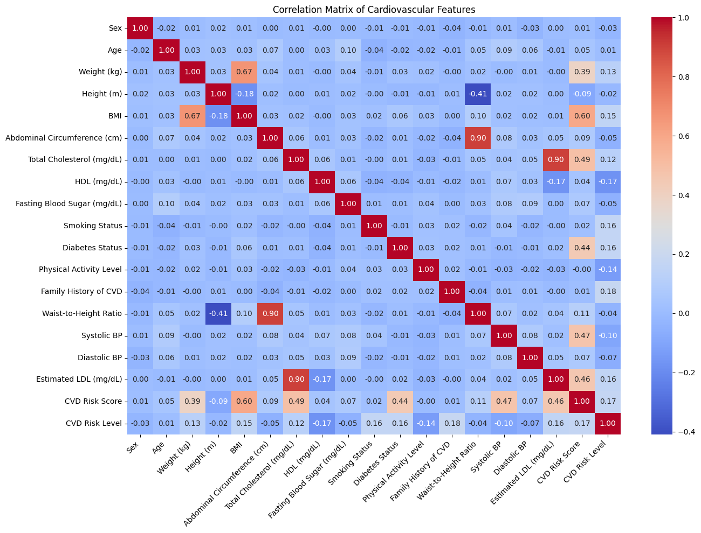
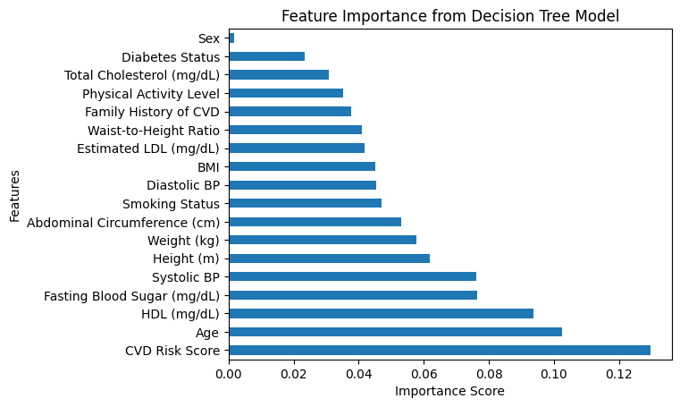
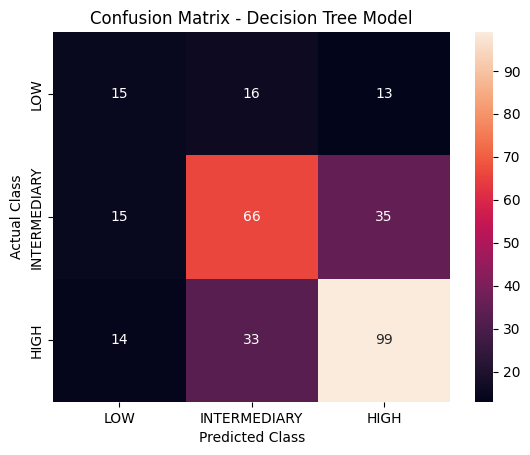
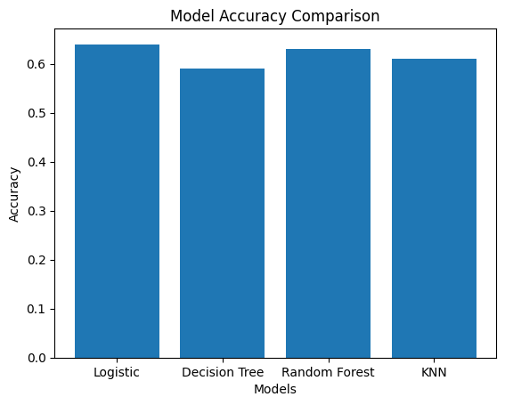

# cardiovascular-risk-prediction-system
Machine Learning based healthcare application for predicting cardiovascular disease risk using patient health data, developed during internship at Prinston Smart Engineers.
## Features

- Data Cleaning and Preprocessing
- Handling Missing Values
- Exploratory Data Analysis (EDA)
- Correlation Analysis
- Feature Importance Analysis
- Machine Learning Model Training
- Model Comparison
- Cardiovascular Risk Prediction
- Interactive Streamlit Web Application

- ## Dataset

- Dataset Name: Cardiovascular Disease Risk Assessment Dataset
- Records: 1,529 patients
- Features: 22 clinical and lifestyle attributes
- Target: CVD Risk Level (Low, Intermediate, High)

- ## Technologies Used

- Python
- Pandas
- NumPy
- Matplotlib
- Seaborn
- Scikit-learn
- Streamlit
- FastAPI
- Google Colab
- Visual Studio Code

- ## Machine Learning Models

The following supervised learning algorithms were implemented and compared:

- Logistic Regression
- Decision Tree
- Random Forest
- K-Nearest Neighbors (KNN)

Random Forest achieved the best prediction performance among the implemented models.

## Project Workflow

1. Dataset Collection
2. Data Cleaning
3. Missing Value Handling
4. Exploratory Data Analysis
5. Feature Engineering
6. Model Training
7. Model Evaluation
8. Risk Prediction
9. Streamlit Frontend Development

## Project Structure

cardiovascular-risk-prediction-system/
│
├── backend/
├── frontend/
├── screenshots/
├── CVD_dataset.ipynb
├── CVD Dataset.csv
└── README.md

## Results

- Successfully classified patients into Low, Intermediate, and High cardiovascular risk categories.
- Compared multiple machine learning models.
- Built an interactive web interface for real-time prediction.

## Screenshots

### Streamlit Interface

### Prediction Output

### Correlation Matrix

### Feature Importance

### Confusion Matrix

### Model Accuracy Comparison

